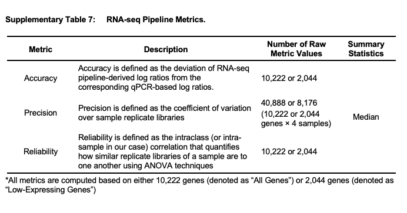

DOI - https://doi.org/10.1038/s41598-020-74567-y

accuracy -  as the deviation of RNA-seq pipeline-derived log ratios of gene expression from the corresponding qPCR-based log ratios.
A smaller deviation represents higher accuracy. Median normalization exhibited the lowest deviation, or the highest accuracy, compared with all other normalization methods.

precision - as the coefficient of variation (CoV) of gene expression across replicate libraries. Smaller CoV represents higher precision.
pipelines with any of Bowtie2 multi-hit, GSNAP un-spliced, or Subread mapping and either count-based or Cufflinks quantification, except for the [Bowtie2 multi-hit + count-based + med.] pipeline, were the best choice for quantifying genes with high precision, or low CoV.

reliability - as the intra-class (i.e., intra-sample in the context of the SEQC-benchmark dataset) correlation (ICC) of gene expression. Larger ICC represents higher reliability.
median normalization along with most mapping and quantification algorithms, except for the [Bowtie2 multi-hit + count-based] and [Novoalign + RSEM] pipelines, was the best choice for quantifying genes with high reliability, or high ICC.

     

  

     

    

The 278 RNA-seq pipelines applied to the SEQC-benchmark dataset differ in terms of gene expression accuracy, precision, and reliability. In each heatmap, the rows are different settings for 13 aligners and the columns are combinations of three quantification and seven normalization methods. (a) Accuracy is defined as the deviation of pipeline-derived log ratios of gene expression from the corresponding qPCR-based log ratios. Median accuracy of all genes (i.e., 10,222 genes) is encoded as color, with red representing the highest accuracy, or the lowest deviation from qPCR. (b) Precision is defined as the coefficient of variation (CoV) of gene expression over replicate libraries. Median precision of all genes is encoded as color, with red indicating the highest precision, or the lowest CoV. (c) Reliability is defined as the intraclass (or intra-sample in our context) correlation that quantifies how similar replicate libraries of a sample are to one another using analysis of variance techniques. Median reliability of all genes is encoded as color, with red representing the highest reliability, or the highest intraclass correlation. Refer to the “Method” section for mathematical definitions of accuracy, precision, and reliability in the context of RNA-seq pipelines.

    

    

    

    

    

    

